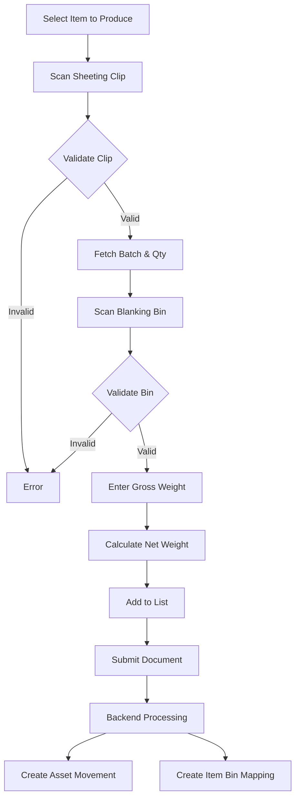

# Blanking DC Entry - Business & Technical Documentation

## Table of Contents

1. [Overview](#overview)
2. [Business Purpose](#business-purpose)
3. [Process Flow](#process-flow)
4. [Data Model](#data-model)
5. [Frontend (JavaScript)](#frontend-javascript)
6. [Backend (Python)](#backend-python)
7. [Related DocTypes](#related-doctypes)
8. [Error Handling](#error-handling)

---

## Overview

| Attribute | Value |
|-----------|-------|
| **DocType Name** | Blanking DC Entry |
| **Module** | Shree Polymer Custom App |
| **Naming Rule** | `BDCE-.#####` |
| **Submittable** | Yes |
| **Created** | 2022-12-20 |

The **Blanking DC Entry** acts as a production declaration document for the Blanking process. It records the conversion of Rubber Sheets (Compound) into Blanked Mats/Preforms, using "Clips" to identify the source material and "Bins" to identify the target transport container.

---

## Business Purpose

### What Problem Does It Solve?

1.  **Production Recording**: Captures the exact quantity of blanks produced from a specific batch of compound.
2.  **Traceability**: Links the source **Sheeting Clip** (Batch info) to the destination **Blanking Bin**, maintaining batch lineage.
3.  **Asset Management**: Tracks the movement of physical Bins (Assets) from the Sheeting area to the Blanking/Press area using `Asset Movement`.
4.  **Auto-Manufacturing**: Automatically generates a `Work Order` and a "Manufacture" `Stock Entry` to reflect the consumption of compound and production of blanks in the ERP.

### Key Features

*   **Barcode Validation**: Dual scanning validation—**Source Clip** (via `scan_clip`) and **Target Bin** (via `scan_bin`).
*   **BOM Validation**: Ensures the Compound in the Clip matches the BOM requirements for the `Item to Produce`.
*   **Weight Capture**: automatically calculates `Net Weight` by subtracting the known `Bin Weight` (from Asset master) from the `Gross Weight` measured by the operator.
*   **Asset Movement**: Automates the digital movement of Bin Assets alongside the stock.

---

## Process Flow

*Note: Historical code also includes logic for auto-creating Work Orders and Stock Entries (`create_blanking_wo`, `make_blanking_stock_entry`), though recent updates emphasize Asset Movement.*

---

## Data Model

### Main Fields

| Field | Type | Purpose |
|-------|------|---------|
| `item_produced` | Link | The Blank/Mat item being manufactured. |
| `posting_date` | Date | Date of production. |
| `scan_clip` | Data (Barcode) | Barcode of the source Sheeting Clip. |
| `scan_bin` | Data (Barcode) | Barcode of the target Blanking Bin. |
| `scanned_item` | Data | The Compound Item Code derived from the Clip. |
| `available_quantity` | Float | Qty available in the scanned Clip. |
| `spp_batch_number` | Data | SPP Batch No from the Clip. |
| `bin_code` | Data | ID of the Bin Asset. |
| `gross_weight_kgs` | Float | Total weight measured (Material + Bin). |
| `net_weight_kgs` | Float | Calculated Material Weight. |
| `items` | Table | List of produced items. |

---

## Frontend (JavaScript)

**File**: `blanking_dc_entry.js` (484 lines)

### Event Handlers

#### 1. Clip Scanning (`scan_clip`)
*   Calls `validate_clip_barcode`.
*   Validates that the Compound in the Clip is compatible with the selected `Item Produced`.
*   Populates fields: `scanned_item`, `available_quantity`, `spp_batch_number`.

#### 2. Bin Scanning (`scan_bin`)
*   Calls `validate_asset_barcode`.
*   Checks if the Bin is "Released" (empty/available) via `Item Bin Mapping`.
*   Fetches `Bin Weight` and `Asset Name`.

#### 3. Weight Calculation
*   **`gross_weight_kgs`**: Triggers calculation of `net_weight_kgs` = Gross - Bin Weight.
*   **Validation**: Ensures Net Weight doesn't exceed `available_quantity` from the clip.

#### 4. Add Button
*   Custom HTML button logic (`add_html`) to validate all fields (Clip, Bin, Weight) before pushing the row to the `items` child table.

---

## Backend (Python)

**File**: `blanking_dc_entry.py` (861 lines)

### Key Methods

#### `validate_clip_barcode` (Whitelist)
1.  **Lookup**: Finds `Item Clip Mapping` for the scanned barcode.
2.  **BOM Check**: Calls `validate_compound` to ensure the Compound is a valid raw material for the `Item Produced` according to the active BOM.
3.  **Stock Check**: Verifies existence and quantity in `Item Batch Stock Balance`.

#### `validate_asset_barcode` (Whitelist)
1.  **Asset Lookup**: Finds the Asset by barcode.
2.  **Status Check**: Checks `Item Bin Mapping`.
    *   If `from_blank_bin_inward` is checked (special mode), it expects the bin to match an existing mapping.
    *   Otherwise (standard mode), it expects the bin to be "Retired" (Empty).

#### `on_submit`
Triggered on Final Submission:
1.  **Asset Movement**: Calls `create___asset_movement` to move the Bin Asset location.
2.  **Bin Mapping**: Creates a new `Item Bin Mapping` record to link the Net Weight of material to the specific Bin ID.
3.  **Legacy/Commented**: Code exists for `create_blanking_wo` (Auto Work Order) and `create_mt_stock_entry` (Stock Transfer), but current active logic emphasizes Asset Movement.

### Helper Functions

*   `check_default_bom`: Validates BOM relationships.
*   `make___rollback`: Deletes created mappings and reverts status in case of failure.

---

## Related DocTypes

| DocType | Relationship |
|---------|--------------|
| **Item** | Configures BOM and Item Groups. |
| **Asset** | Represents the Physical Bins. |
| **Item Clip Mapping** | Source of compound data. |
| **Item Bin Mapping** | Created to track compund in the Bin. |
| **Asset Movement** | Created to track Bin location changes. |
| **Work Order** | (Conditional) Created for production. |
| **Stock Entry** | (Conditional) Created for material consumption/production. |

---

## Error Handling

*   **Rollback**: The `make___rollback` function manually deletes created `Item Bin Mapping` records and resets the document status if the Asset Movement creation fails.
*   **Stock Validation**: Frontend prevents adding items if Net Weight > Available Stock.
