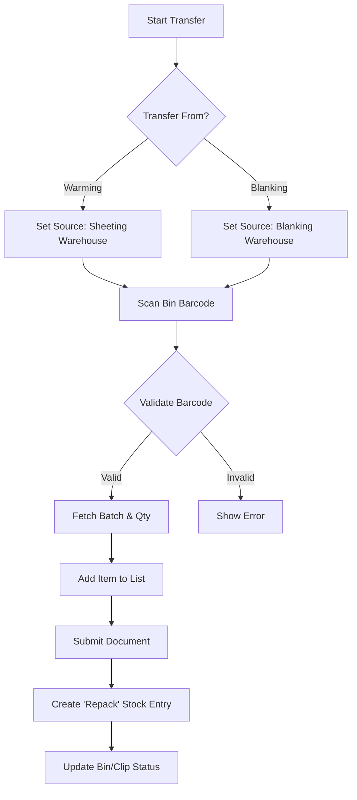

# Cut Bit Transfer - Business & Technical Documentation

## Table of Contents

1. [Overview](#overview)
2. [Business Purpose](#business-purpose)
3. [Process Flow](#process-flow)
4. [Data Model](#data-model)
5. [Frontend (JavaScript)](#frontend-javascript)
6. [Backend (Python)](#backend-python)
7. [Related DocTypes](#related-doctypes)
8. [Error Handling](#error-handling)

---

## Overview

| Attribute | Value |
|-----------|-------|
| **DocType Name** | Cut Bit Transfer |
| **Module** | Shree Polymer Custom App |
| **Naming Rule** | `CBT-.#####` |
| **Submittable** | Yes |
| **Created** | 2022-12-03 |

The **Cut Bit Transfer** DocType is designed to manage the return of leftover materials ("Cut Bits") from operational areas (Warming/Sheeting or Blanking) back to a designated storage area. It validates the material using container barcodes (Clips or Bins) and ensures inventory accuracy.

---

## Business Purpose

### What Problem Does It Solve?

1.  **Waste/Leftover Management**: Systematically tracks small quantities of leftover compound from production processes.
2.  **Process-Specific Return**: Handles returns from two specific origins:
    *   **Warming**: Returning cut bits from the Sheeting process (identified by **Sheeting Clips**).
    *   **Blanking**: Returning cut bits from the Blanking process (identified by **Bins**).
3.  **Bin/Clip Management**: Automatically updates the status of Bins or Clips (marking them as "retired" or reducing their quantity) once the material is transferred.
4.  **Auto-Stock Entry**: Generates a "Repack" Stock Entry to officially move the stock in the ERP.

### Key Features

*   **Barcode Validation**: Scans Clips or Bins to automatically fetch Item, Batch, and Quantity details.
*   **Source Logic**: Automatically sets the Source Warehouse based on the selected "Transfer From" process (Warming $\rightarrow$ Sheeting Warehouse, Blanking $\rightarrow$ Blanking Warehouse).
*   **Cut Bit Verification**: If scanning a generic "Cut Bit" barcode (`cb_...`), it checks if the item allows cut bit usage.

---

## Process Flow

---

## Data Model

### Main Fields

| Field | Type | Purpose |
|-------|------|---------|
| `transfer_from` | Select | Origin process: "Warming" or "Blanking". |
| `source_warehouse` | Link | Auto-set based on `transfer_from`. |
| `target_warehouse` | Link | Destination (Hidden/Implicitly handled). |
| `scan_clip__bin` | Data (Barcode) | Input field for scanning container barcodes. |
| `employee` | Link | Operator performing the transfer. |
| `items` | Table | List of materials being transferred. |
| `stock_entry_reference` | Data | ID of the generated Stock Entry. |

### Child Table: Items (`items`)

| Field | Type | Purpose |
|-------|------|---------|
| `item_code` | Link | Compound Item Code. |
| `batch_no` | Link | System Batch Number. |
| `spp_batch_no` | Data | SPP Batch Number. |
| `qty` | Float | Quantity being returned. |
| `ct_source_warehouse` | Link | Specific source warehouse for the line item. |

---

## Frontend (JavaScript)

**File**: `cut_bit_transfer.js` (228 lines)

### Event Handlers

#### 1. Source Selection (`transfer_from`)
*   **Warming**: Sets Source Warehouse to `Sheeting Warehouse - SPP INDIA`.
*   **Blanking**: Sets Source Warehouse to `Blanking Warehouse - SPP INDIA`.

#### 2. Barcode Scanning (`scan_clip__bin`)
*   **Clip/Bin Scan**: Calls `validate_clip_barcode`.
    *   If successful, adds the item to the table.
    *   Prevents duplicate scanning of the same item/batch/barcode combination.
*   **Cut Bit Scan (`cb_...`)**: Special handling for barcodes starting with "cb_". Checks if the scanned item matches an existing item in the list and sets the `cut_bit_item` field.

#### 3. Manual Entry
*   Logic mirrors the main scanning function but uses the `manual_scan_spp_batch_number` field.

---

## Backend (Python)

**File**: `cut_bit_transfer.py` (218 lines)

### Key Methods

#### `validate_clip_barcode` (Whitelist)
Identify material based on the container:
1.  **Clip Lookup**: Checks `Item Clip Mapping` table for the barcode.
2.  **Bin Lookup**: Checks `Item Bin Mapping` table (joined with Asset/Bin).
3.  **Stock Verification**: joins `Stock Entry Detail` and `Item Batch Stock Balance` to find the specific batch's system ID and quantity.
4.  **Priority**: Checks Cut Bit warehouse first, then general warehouse, to prioritize finding existing cut bits.
5.  **Return**: Returns the Stock Detail object to populate the frontend.

#### `on_submit`
Calls `create_stock_entry`.

#### `create_stock_entry`
1.  **Config**: Fetches specific Naming Series and Warehouse defaults from `SPP Settings`.
2.  **Batch Logic**: Checks if a "Cutbit" specific batch exists (`Cutbit_ITEMCODE`). If so, switches the outgoing batch ID to this consolidated batch.
3.  **Stock Entry Items**:
    *   **Source Line**: Removes item from Source Warehouse (Warming/Blanking).
    *   **Target Line**: Adds item to Target Warehouse (Cut Bit Warehouse).
4.  **Bin Update**: If transfer is from **Blanking**:
    *   Finds the associated `Item Bin Mapping`.
    *   If Qty matches exactly $\rightarrow$ Retires the mapping (`is_retired=1`).
    *   If Partial Qty $\rightarrow$ Reduces the mapping quantity.

### Helper Functions

*   `get_process_based_employess`: Filters employee list based on "Cut Bit Transfer" role from settings.

---

## Related DocTypes

| DocType | Relationship |
|---------|--------------|
| **Stock Entry** | Created on submit (Type: "Repack"). |
| **Sheeting Clip** | Scanned entity for Warming transfers. |
| **Asset (Bin)** | Scanned entity for Blanking transfers. |
| **Item Clip/Bin Mapping** | Stores the link between container and material batch/qty. |
| **SPP Settings** | Configuration for warehouses and roles. |

---

## Error Handling

*   **Validation**: Frontend checks prevent duplicates. Backend validates barcode existence.
*   **Cancellation**: `on_cancel` calls `delete_stock_entry_safely` to ensure the linked Stock Entry is removed cleanly.
