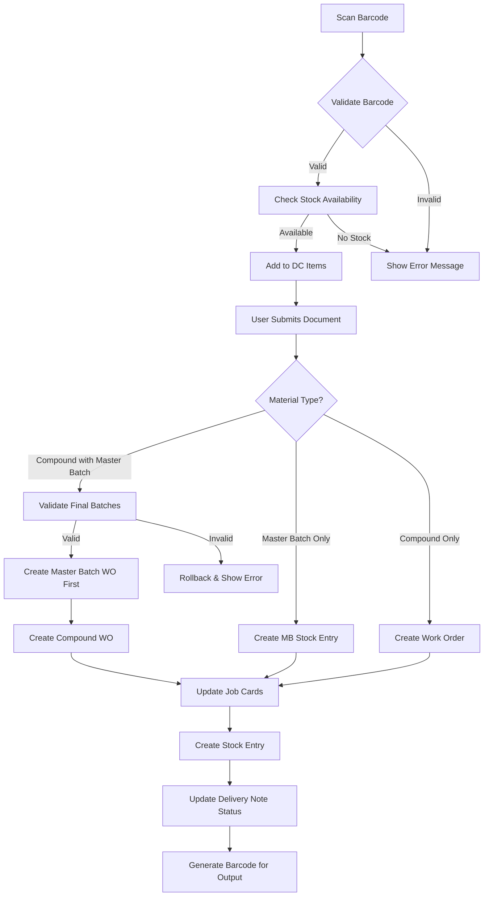

# Delivery Challan Receipt - Business & Technical Documentation

## Table of Contents

1. [Overview](#overview)
2. [Business Purpose](#business-purpose)
3. [Process Flow](#process-flow)
4. [Data Model](#data-model)
5. [Frontend (JavaScript)](#frontend-javascript)
6. [Backend (Python)](#backend-python)
7. [Related DocTypes](#related-doctypes)
8. [Error Handling & Rollback](#error-handling--rollback)

---

## Overview

| Attribute | Value |
|-----------|-------|
| **DocType Name** | Delivery Challan Receipt |
| **Module** | Shree Polymer Custom App |
| **Naming Rule** | `MTDCR-.YYYY.-.MM.-.DD.-.#####` |
| **Submittable** | Yes |
| **Created** | 2022-10-17 |

The **Delivery Challan Receipt** is a submittable DocType used to receive mixed materials (Master Batch or Compound) at mixing centers. It integrates with:
- **Delivery Note**: Updates received status
- **Work Order**: Auto-creates manufacturing orders
- **Job Card**: Updates production tracking
- **Stock Entry**: Creates material transfer/manufacture entries

---

## Business Purpose

### What Problem Does It Solve?

In polymer manufacturing, materials go through a mixing process before being used in production. This DocType tracks:

1. **Receipt of Mixed Materials**: When materials arrive at a mixing center from a Delivery Note
2. **Barcode-Based Tracking**: Each batch has a unique barcode/mix_barcode for traceability
3. **Auto Work Order Creation**: Triggers manufacturing workflow upon submission
4. **Stock Movements**: Automatically consumes raw materials and produces finished goods

### Two Operational Modes

| Mode | Field | Description |
|------|-------|-------------|
| **Normal Receipt** | `hold_receipt = 0` | Standard material receipt with DC Items table |
| **Hold Receipt** | `hold_receipt = 1` | Holding mode using separate items table for mixing center materials |

### Material Types Handled

| Type | Description |
|------|-------------|
| **Master Batch** | Base material batch for mixing |
| **Compound** | Final mixed compound product |

---

## Process Flow



### Submission Flow

1. **Validate** - Date cannot be in future
2. **Validate Final Batches** - For Compound type, ensures correct batch combinations
3. **Create Work Orders** - Based on BOM configurations
4. **Update Job Cards** - With completion quantities
5. **Create Stock Entries** - Manufacture type entries
6. **Update Delivery Note** - Mark items as received

---

## Data Model

### Main Fields

| Field | Type | Purpose |
|-------|------|---------|
| `hold_receipt` | Check | Toggle between normal/hold receipt mode |
| `is_internal_mixing` | Check | Internal vs external mixing process |
| `enter_manually` | Check | Manual barcode entry toggle |
| `inward_material_type` | Select | "Master Batch" or "Compound" |
| `scan_barcode` | Data (Barcode) | Scanner input field |
| `source_warehouse` | Link → Warehouse | Origin warehouse for materials |
| `dc_receipt_date` | Date | Mixing date |
| `mixing_time` | Time | Time of mixing operation |
| `dc_number` | Data | Reference DC number |
| `dc_items` | Table → DC Item | Normal receipt items (when `hold_receipt=0`) |
| `hld_items` | Table → Mixing Center Holding Item | Hold receipt items (when `hold_receipt=1`) |
| `stock_entry_reference` | Small Text | Comma-separated Stock Entry IDs |

### Child Table: DC Item

| Field | Type | Purpose |
|-------|------|---------|
| `scan_barcode` | Data | Scanned barcode value |
| `item_code` | Link → Item | Material item code |
| `batch_no` | Link → Batch | Batch reference |
| `qty` | Float | Quantity in Kg |
| `dc_no` | Data | Source Delivery Note |
| `operation` | Data | Operation type (Batch/Mixing) |
| `item_to_manufacture` | Link → Item | Target manufactured item |
| `work_order_ref` | Data | Created Work Order reference |
| `is_batch_item` | Check | Master Batch indicator |
| `mb_batch_code` | Data | Master Batch code (hidden) |
| `mb_item_code` | Data | Master Batch item (hidden) |

### Child Table: Mixing Center Holding Item

| Field | Type | Purpose |
|-------|------|---------|
| `item_code` | Data | Material item code |
| `spp_batch_no` | Data | SPP batch identifier |
| `batch_no` | Data | Batch reference |
| `qty` | Float | Quantity |
| `mix_barcode` | Data | Mix barcode for scanning |
| `work_order_ref` | Data | Created Work Order reference |

---

## Frontend (JavaScript)

**File**: `delivery_challan_receipt.js` (393 lines)

### Global State

```javascript
var scanned_batches = [];  // Tracks already scanned barcodes to prevent duplicates
```

### Key Event Handlers

#### 1. Barcode Scanning (`scan_barcode`)

```javascript
"scan_barcode": function(frm) {
    // Check for duplicates
    if (scanned_batches.indexOf(frm.doc.scan_barcode) == -1) {
        frappe.call({
            method: 'validate_barcode',
            args: {
                batch_no: frm.doc.scan_barcode,
                warehouse: frm.doc.source_warehouse,
                batch_type: frm.doc.inward_material_type
            },
            callback: function(r) {
                if (r.message.status == "Success") {
                    // Add item to dc_items child table
                    // Auto-set source_warehouse from stock lookup
                }
            }
        });
    }
}
```

#### 2. Manual Barcode Entry (`enter_manually`)

When enabled, listens for input changes on `manual_scan_spp_batch_number` field with a 1-second debounce.

#### 3. Hold Barcode Scanning (`hld_barcode`, `hld_manual_barcode`)

Similar logic for hold receipt mode, adds items to `hld_items` table.

### Form Behaviors

| Event | Behavior |
|-------|----------|
| `refresh` | Sets warehouse filters, adds View Stock Entry button |
| `hold_receipt` | Toggles required fields based on mode |
| `is_internal_mixing` | Auto-sets source warehouse to "U3-Store - SPP INDIA" |
| `timeline_refresh` | Adds View Stock Entry custom button |

### Custom Button: View Stock Entry

```javascript
if (frm.doc.stock_entry_reference) {
    frm.add_custom_button(__("View Stock Entry"), function() {
        frappe.set_route("List", "Stock Entry", {
            "name": ["in", frm.doc.stock_entry_reference.split(',')]
        });
    });
}
```

---

## Backend (Python)

**File**: `delivery_challan_receipt.py` (1514 lines)

### Class: DeliveryChallanReceipt

```python
class DeliveryChallanReceipt(Document):
    def validate(self):
        # Future date validation
        if self.dc_receipt_date and getdate(self.dc_receipt_date) > getdate():
            frappe.throw("Mixing Date can't be greater than Today Date")

    def on_submit(self):
        # Main submission logic
        try:
            fb_mix = validate_final_batches(self)
            if fb_mix:
                wo, message = create_wo(self)
                if wo:
                    update_over_all_dn_status(self, "Not Hold")
                else:
                    rollback_wo_se_jc(self, message)
        except Exception:
            rollback_wo_se_jc(self, "Stock Entry Creation Error")

    def on_cancel(self):
        # Revert Delivery Note Item received status
        for dc_items in self.dc_items:
            if dc_items.dc_no:
                # Set is_received = 0, clear dc_receipt_no
```

### Key Whitelist Functions

#### `validate_barcode(batch_no, warehouse, is_internal_mixing, batch_type)`

Validates a scanned barcode against stock:

1. Checks `Item Batch Stock Balance` for available quantity
2. Validates against `Delivery Note Item` for unreceived items
3. Looks up BOM to find item to manufacture
4. Returns stock details or error message

```python
@frappe.whitelist()
def validate_barcode(batch_no, warehouse=None, is_internal_mixing=0, batch_type=None):
    # Multi-step validation:
    # 1. Check stock in Delivery Note context
    # 2. Check U3-Store for internal mixing
    # 3. Check Kneader Mixing stock
    # 4. Validate BOM exists for the item
    # 5. Verify batch_type matches (Master Batch vs Compound)
```

#### `create_wo(dc_rec)`

Main Work Order creation orchestrator:

```python
@frappe.whitelist()
def create_wo(dc_rec):
    if dc_rec.hold_receipt == 0:
        # Normal mode: Group by DC No and Operation
        for x in dc_nos:
            if item_group != "Compound":
                # Create WO for Master Batch/Final Batch
            else:
                # Create WO for Compound (final batch mixing)
    else:
        # Hold mode: Create Work Orders for held items
        create_hold_wos(dc_rec)
```

### Stock Entry Creation Functions

| Function | Purpose |
|----------|---------|
| `make_stock_entry()` | Standard manufacture entry for non-compound items |
| `make_stock_entry_final_batch()` | For final batch mixing with multiple raw materials |
| `make_hold_stock_entry()` | For hold receipt mode |
| `make_mb_stock_entry()` | Master Batch stock entry |
| `make_stock_entry_c()` | Compound stock entry |

### Barcode Generation

```python
def generate_barcode(compound):
    import code128
    from PIL import Image, ImageDraw
    
    barcode_image = code128.image(compound, height=120)
    # Save to /public/files/{barcode_text}.png
    return {"barcode": barcode, "barcode_text": barcode_text}
```

### SPP Batch Numbering

```python
def get_spp_batch_date(compound):
    # Format: YY + MonthLetter + DD + "X" + SerialNo
    # Example: 26A01X1 (2026-Jan-01, Serial 1)
    month_key = getmonth(month)  # A=Jan, B=Feb, ... L=Dec
    return f"{year}{month_key}{day}X{serial_no}"
```

### Job Card Updates

```python
def update_job_cards(wo_name, actual_weight, employee, spp_settings):
    # For each job card:
    # 1. Create time logs if missing
    # 2. Set completed_qty
    # 3. Resolve WIP warehouse
    # 4. Save with docstatus = 1
```

---

## Related DocTypes

| DocType | Relationship |
|---------|--------------|
| **Delivery Note** | Source document, items marked as received |
| **Delivery Note Item** | Updated with `is_received`, `dc_receipt_no`, `dc_receipt_date` |
| **Work Order** | Created for each manufacture operation |
| **Job Card** | Updated with completion details |
| **Stock Entry** | Material consumption and finished goods production |
| **SPP Settings** | Configuration for warehouses, employees |
| **SPP Batch Serial** | Serial number tracking for batches |
| **Mixing Operation** | Maps warehouse → operation/workstation |
| **BOM** | Defines item recipes and raw materials |

---

## Error Handling & Rollback

### `rollback_wo_se_jc(info, msg)`

Comprehensive rollback function that cleans up on failure:

```python
def rollback_wo_se_jc(info, msg):
    # 1. Delete Stock Entries linked to Work Orders
    # 2. Delete Job Cards
    # 3. Delete Work Orders
    # 4. Reset Delivery Note Item received status
    # 5. Delete stock_entry_reference entries
    # 6. Reset document to Draft (docstatus = 0)
    # 7. Show error message to user
```

### Error Logging

All exceptions are logged using:

```python
frappe.log_error(
    title="shree_polymer_custom_app...function_name",
    message=frappe.get_traceback()
)
```

---

## Validation Rules

### Date Validation

- `dc_receipt_date` cannot be in the future

### Final Batch Validation (`validate_final_batches`)

For Compound material type:

1. Groups items by `item_to_manufacture` and `operation`
2. If batch items exist, requires both Master Batch AND Final Batch items
3. Validates BOM item count matches received items

### BOM Validation

- Single active BOM required per item (multi-BOM throws error)
- BOM items must match received items

### Warehouse Validation

- All scanned items must belong to same source warehouse

---

## Naming Series Configuration

Stock Entries use dynamic naming based on process:

| Process | Internal Mixing | External Mixing |
|---------|----------------|-----------------|
| FB/MB Receipt | DC Receipt (FB and MB) For Internal Mixing | DC Receipt (FB and MB) For External Mixing |
| Compound Receipt | DC Receipt (C) For Internal Mixing | DC Receipt (C) For External Mixing |

---

## Permissions

| Role | Create | Read | Write | Delete | Submit |
|------|--------|------|-------|--------|--------|
| System Manager | ✓ | ✓ | ✓ | ✓ | ✓ |

---

## Usage Flow Example

### Normal Receipt (Compound)

1. Select **Inward Material Type** = "Compound"
2. Scan barcode → System validates and adds to DC Items
3. Repeat for all items in the batch
4. Set **Mixing Date** and **Mixing Time**
5. Submit document
6. System creates:
   - Work Order for compound manufacturing
   - Job Cards with time logs
   - Stock Entry (Manufacture type)
   - Updates Delivery Note as received
   - Generates new barcode for output

### Hold Receipt

1. Enable **Hold Receipt** checkbox
2. Select **Source Warehouse** for held items
3. Scan held item barcodes
4. Submit to create Work Orders for held inventory
