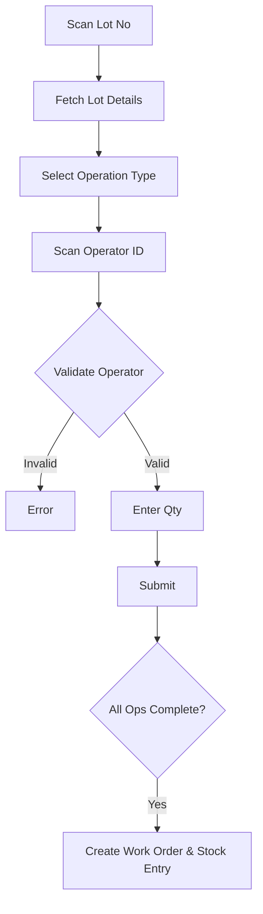

# Lot Resource Tagging - Business & Technical Documentation

## Table of Contents

1. [Overview](#overview)
2. [Business Purpose](#business-purpose)
3. [Process Flow](#process-flow)
4. [Data Model](#data-model)
5. [Backend Logic](#backend-logic)
6. [Related DocTypes](#related-doctypes)

---

## Overview

| Attribute | Value |
|-----------|-------|
| **DocType Name** | Lot Resource Tagging |
| **Module** | Shree Polymer Custom App |
| **Naming Rule** | `LRST-.YYYY.-.#####` |
| **Submittable** | Yes |

**Lot Resource Tagging (LRT)** is a critical tracking mechanism in the finishing process. It records *who* (Employee) did *what* (Operation) on *which* lot at *what* workstation.

---

## Business Purpose

### What Problem Does It Solve?

1.  **Granular Traceability**: Tracks the exact history of operations (e.g., Trimming, Dot Marking) performed on a specific lot.
2.  **Productivity Tracking**: Links employees to operations, enabling productivity analysis.
3.  **Process Enforcement**: Ensures that operations are performed in the correct sequence as defined in the BOM.
4.  **Auto-Production Recording**: Can automatically generate `Work Order` and `Manufacture` Stock Entries to formally record production in ERPNext.

---

## Process Flow

---

## Data Model

### Main Fields

| Field | Type | Purpose |
|-------|------|---------|
| `scan_lot_no` | Barcode | The lot being processed. |
| `operation_type` | Data | The specific operation (e.g., "Trimming OD"). |
| `scan_operator` / `operator_id` | Data/Link | Employee performing the work. |
| `workstation` | Link | Where the work is happening. |
| `qtynos` | Float | Quantity processed. |
| `product_ref` | Link (Item) | The item being processed. |
| `stock_entry_ref` | Link | Link to the created Stock Entry (Manufacture). |
| `work_order_ref` | Link | Link to the created Work Order. |

---

## Backend Logic

**File**: `lot_resource_tagging.py`

### Key Methods

#### `validate_lot_number` (Whitelist)
*   Verifies that the lot exists and has stock in the source warehouse.
*   Validation Chain:
    1.  Checks `Stock Entry Detail` for the lot.
    2.  Checks `Deflashing Receipt Entry` (if applicable).
    3.  Validates `Incoming Inspection` is complete.
*   **BOM Validation**: Fetches the BOM for the item and identifies available operations.

#### `validate_inspector_barcode` (Whitelist)
*   **Purpose**: Security check.
*   **Logic**: Verifies that the scanned Employee ID has the correct **Designation** (mapped in `SPP Settings`) to perform the specific `operation_type`.

#### `make_wo_stock_entry`
*   **Trigger**: Can be called when operations are complete.
*   **Action**: Automates the ERPNext manufacturing cycle.
    1.  **Create Work Order**: Creates a generic WO for the item and quantity.
    2.  **Create Job Card**: Updates Job Cards with actual times and employee details.
    3.  **Create Stock Entry**: detailed "Manufacture" entry, consuming raw material and producing finished goods.
    4.  **Updates Final Inspection**: Links the created WO/SE to the `Inspection Entry` (Final Visual Inspection) for downstream traceability.

---

## Related DocTypes

| DocType | Relationship |
|---------|--------------|
| **Sub Lot Creation** | Source of lots. |
| **SPP Settings** | Maps Designations to Processes. |
| **Work Order / Job Card** | Created documents. |
| **Inspection Entry** | Validation prerequisite & downstream link. |
