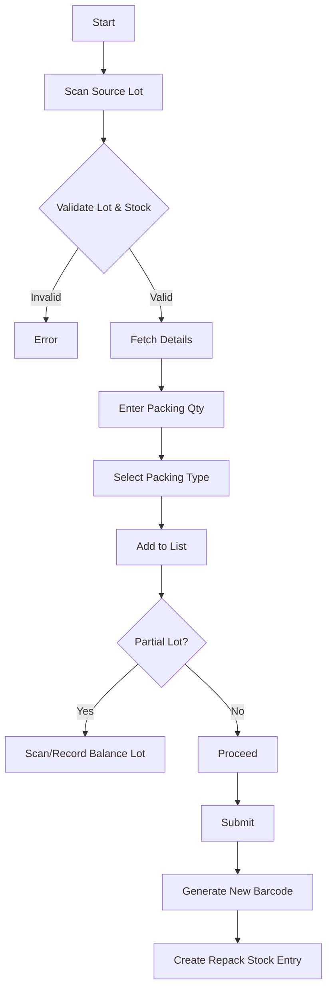

# Packing Process - Business & Technical Documentation

## Table of Contents

1. [Overview](#overview)
2. [Business Purpose](#business-purpose)
3. [Process Flow](#process-flow)
4. [Data Model](#data-model)
5. [Backend Logic](#backend-logic)
6. [Frontend Logic](#frontend-logic)
7. [Related DocTypes](#related-doctypes)

---

## Overview

| Attribute | Value |
|-----------|-------|
| **DocType Name** | Packing |
| **Module** | Shree Polymer Custom App |
| **Naming Rule** | `PACKG-.#####` |
| **Submittable** | Yes |

The **Packing** DocType manages the final stage of production where finished goods (typically scanned by Lot Number) are packed into customer-specific configurations (e.g., Boxes, Bags). It handles stock conversion via "Repack" entries and generates new unique barcodes for the packed units.

---

## Business Purpose

### What Problem Does It Solve?

1.  **Final Product Transformation**: Converts loose/bulk finished goods into packed, shippable units.
2.  **Inventory Accuracy**: Deducts loose stock and adds packed stock to the inventory, ensuring the system reflects physical reality.
3.  **Traceability**: Links the packed unit's new barcode back to the original manufacturing lot(s).
4.  **Partial Consumption**: Handles cases where a source lot is not fully packed, tracking the "Balance Lot" quantity.
5.  **Barcode Generation**: Automatically generates and prints unique barcodes for the consolidated packed units.

---

## Process Flow

---

## Data Model

### Main Fields

| Field | Type | Purpose |
|-------|------|---------|
| `scan_lot_no` | Barcode | The source lot being packed. |
| `item` | Link (Item) | The target item (Packed Product). |
| `qty_kgs` / `qty_nos` | Float | Quantity being packed. |
| `packing_type` | Select | Type of packing (e.g., Box, Bag). Sourced from `SPP Settings`. |
| `available_qty` | Float | Stock available in the source lot. |
| `items` | Table | List of source items/lots being consumed. |
| `stock_entry_reference` | Link | Link to the created "Repack" Stock Entry. |
| `barcode_text` | Data | The newly generated barcode for the packed unit. |
| `balance_lot_items` | Table | Tracks remaining quantity if the source lot isn't fully used. |

---

## Backend Logic

**File**: `packing.py`

### Key Methods

#### `validate_lot_barcode` (Whitelist)
*   **Purpose**: Validates the scanned source lot.
*   **Logic**:
    *   Searches for a `Stock Entry` (Type: "Manufacture") that produced this batch (`batch_no` or `F` + `batch_no`).
    *   Verifies stock availability in `U1-Store` or `U2-Store`.
    *   Fetches the item details and associated customer items.
    *   Validates that the scanned lot matches the expected Customer Item.

#### `make_repack_entry`
*   **Trigger**: `on_submit`
*   **Action**: Creates a **Stock Entry** of type `Repack`.
*   **Inventory Movement**:
    *   **Source (Consumption)**: Removes quantity of the *Source Item* (from `items` table) from the warehouse.
    *   **Target (Production)**: Adds quantity of the *Target Item* (Packed Item) to the same warehouse.
*   **Traceability**: The stock entry links the consumed batch to the produced item, maintaining the lineage.

#### `generate_barcode_serial_no`
*   **Purpose**: Creates a unique identifier for the packed unit.
*   **Process**:
    1.  Increments a daily counter in `Packing Serial No` DocType.
    2.  Format: `Date-SerialNo` (e.g., `20231027-0042`).
    3.  Generates a Code128 barcode image and attaches it to the document.

---

## Frontend Logic

**File**: `packing.js`

*   **UOM Conversion**: Automatically calculates `qty_nos` from `qty_kgs` (and vice-versa) based on the Item's UOM Conversion Factor.
*   **Balance Lot Handling**:
    *   If the user indicates a balance exists (`no_balance_lot` unchecked), the system prompts to scan/verify the "Balance Lot".
    *   Validates that the balance quantity + packed quantity does not exceed total available stock.
*   **Add Button**: Validates all inputs (Stock, Item, Qty) before adding the source lot to the `items` table.

---

## Related DocTypes

| DocType | Relationship |
|---------|--------------|
| **Stock Entry** | "Repack" entry moves inventory. |
| **Packing Serial No** | Generates unique serials for packed units. |
| **SPP Settings** | Defines available `Packing Types`. |
| **Job Card / Work Order** | Source of the manufacturing lots. |
