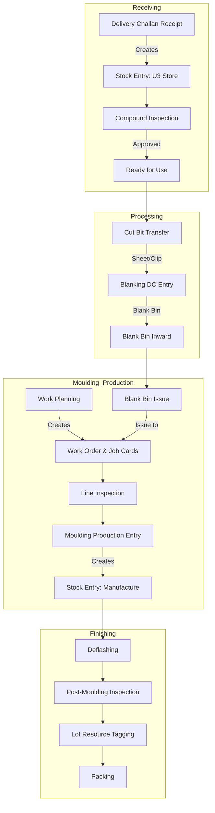

# Shree Polymer Custom App - Manufacturing Process Documentation

## Overview

This application manages the improved manufacturing workflow for Shree Polymer, covering the entire lifecycle from raw material receipt to finished goods packing. It customizes the standard ERPNext manufacturing modules to support:

*   **Barcode-driven workflows** for shop floor efficiency.
*   **Asset-based tracking** (Bins/Clips) for WIP inventory.
*   **Batch & Lot traceability** (SPP Batch Numbers).
*   **Quality Control** integration at critical stages.

## End-to-End Process Flow

For a comprehensive diagram covering all decision points, validation logic, and stock entries, see the **[Detailed Process Flow Chart](detailed_process_flow.md)**.

The following simplified diagram illustrates the high-level flow of materials and data through the system.

---

## Detailed Process Steps

Click on any step below to view detailed business logic, data models, and technical implementation details.

### 1. Receiving & Inspection
*   **[Delivery Challan Receipt](Delivery_Challan_Receipt_Documentation.md)**: Entry point for raw materials (Compounds/Master Batches). Handles barcoded receipt and initial Stock Entries.
*   **[Compound Inspection](Compound_Inspection_Documentation.md)**: Quality assurance step. Checks maturation (aging), Hardness, and specific gravity before releasing material for production.

### 2. Material Preparation
*   **[Material Transfer / Cut Bit Transfer](Cut_Bit_Transfer_Documentation.md)**: Moves material from stores to production floors (Sheeting/Cut Bit Warehouse). Handles conversion of Batch items to Cut Bits.
*   **[Blanking DC Entry](Blanking_DC_Entry_Documentation.md)**: Records the "Blanking" process (cutting sheets into blanks).
    *   *Input*: Sheeting Clips/Rolls.
    *   *Output*: Blanking Bins (tracked as Assets).
*   **[Blank Bin Inward Entry](Blank_Bin_Inward_Entry_Documentation.md)**: Receives the specific Blanking Bins at the Moulding Unit.

### 3. Production Planning
*   **[Work Planning](Work_Planning_Documentation.md)**: Shift-based production scheduling.
    *   Assigns Supervisors, Shifts, and Presses.
    *   Automatically generates **Work Orders** and **Job Cards**.
    *   Generates the unique **Lot Number** for the shift.

### 4. Moulding Execution
*   **[Blank Bin Issue](Blank_Bin_Issue_Documentation.md)**: Issues specific Blind Bins to a Job Card (Press). Validates that the material in the Bin matches the BOM.
*   **[Inspection Entry](Inspection_Entry_Documentation.md)**: Captures Line Inspections and Patrol Inspections during the moulding process.
*   **[Moulding Production Entry](Moulding_Production_Entry_Documentation.md)**: The primary shop-floor entry for production.
    *   Consumes Blank Bins.
    *   Records Output (Good Qty), Rejection, and Scrap.
    *   Finalizes the Stock Entry for the Work Order.

### 5. Post-Processing
*   **[Deflashing Despatch](Deflashing_Despatch_Entry_Documentation.md)** & **[Deflashing Receipt](Deflashing_Receipt_Entry_Documentation.md)**: Tracks movement of moulded goods to/from the Deflashing section (often external or separate area).
*   **[Receive Deflashing Entry](Receive_Deflashing_Entry_Documentation.md)**: Receives processed goods back into inventory.
*   **[Sub Lot Creation](Sub_Lot_Creation_Documentation.md)**: Optional step to split lots if needed.

### 6. Finalization
*   **[Lot Resource Tagging](Lot_Resource_Tagging_Documentation.md)**: Final verification and tagging of finished lots.
*   **[Packing](Packing_Documentation.md)**: Generation of packing slips and final box labels.

---

## Core Technologies & Concepts

### 1. SPP Settings
A global settings DocType that controls:
*   Default Warehouses for each stage.
*   Employee Role Mappings (Supervisors, Inspectors).
*   Tolerance limits for rejection and weight.

### 2. Asset-Based Inventory
Instead of standard bin locations, this app often tracks inventory via **Asset** records (Moulding Bins, Sheeting Clips).
*   **Item Bin Mapping**: Link table tracking which Compound Batch is currently inside which Asset (Bin).
*   **Asset Movement**: Uses standard ERPNext Asset Movements to physically track the location of these bins.

### 3. Barcode Integration
Almost every DocType is designed for "Scan-and-Go" operations.
*   **Mix Barcode**: Generated at receipt.
*   **Bin Barcode**: Fixed asset tag.
*   **Lot Barcode**: Generated at Work Planning.

### 4. Automated "Back-Office" Documents
To simplify the shop floor experience, the user interacts with custom DocTypes (like *Moulding Production Entry*). The system uses Python hooks to automatically create and submit the complex ERPNext documents in the background:
*   Work Orders
*   Job Cards
*   Stock Entries (Material Transfer/Manufacture/Repack)
