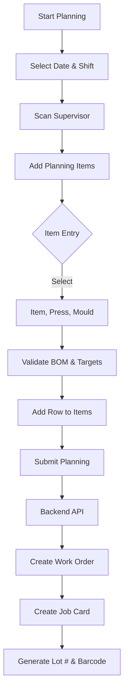

# Work Planning & Add On Work Planning - Business & Technical Documentation

## Table of Contents

1. [Overview](#overview)
2. [Business Purpose](#business-purpose)
3. [Process Flow](#process-flow)
4. [Data Model](#data-model)
5. [Frontend (JavaScript)](#frontend-javascript)
6. [Backend (Python)](#backend-python)
7. [Related DocTypes](#related-doctypes)
8. [Error Handling](#error-handling)

---

## Overview

| Attribute | Work Planning | Add On Work Planning |
|-----------|---------------|----------------------|
| **DocType Name** | Work Planning | Add On Work Planning |
| **Module** | Shree Polymer Custom App | Shree Polymer Custom App |
| **Naming Rule** | `WRKP-.#####` | `ADWRKP-.#####` |
| **Submittable** | Yes | Yes |

These DocTypes are used to schedule production shifts for Moulding, assigning specific Items, Moulds, and Presses to Supervisors. They trigger the automatic creation of **Work Orders** and **Job Cards**.

---

## Business Purpose

### What Problem Does It Solve?

1.  **Production Scheduling**: digitizes the planning of what to produce, where (Press/Workstation), and by whom (Supervisor) for a specific Shift.
2.  **Automation**: Automates the creation of manufacturing documents (Work Orders) and tracking documents (Job Cards) to save manual entry time.
3.  **Target Tracking**: Validates planned quantities against defined Shift Targets to ensure production goals are met.
4.  **Lot Traceability**: Generates specific "Moulding Serial Numbers" and "SPP Batch Numbers" for traceability.

### Key Features

*   **Shift Management**: Validates Supervisor allocation vs Shift Schedules.
*   **Target Validation**: Checks if the item being planned has a valid "Target Qty" defined in `Work Plan Item Target`.
*   **Auto-Creation**:
    *   **Work Order**: Created for the calculated target quantity.
    *   **Job Cards**: Created for the Supervisor to track time and output.
*   **Mould Validation**: Ensures the selected Mould is Active and compatible with the Item/Press.

---

## Process Flow

---

## Data Model

### Main Fields

| Field | Type | Purpose |
|-------|------|---------|
| `date` | Date | The production date. |
| `shift_type` | Link (Shift Type) | The shift (e.g., Morning, Night). |
| `scan_supervisor` | Data (Barcode) | Barcode scan to identify Supervisor. |
| `supervisor_id` | Link (Employee) | The scanned Supervisor. |
| `item_produced` | Link (Item) | The product to be manufactured. |
| `work_station` | Link (Workstation) | The Press/Machine assigned. |
| `mould` | Link (Item) | The specific Mould Tool used. |
| `items` | Table | List of planned jobs. |
| `job_card_wo` | Check | Flag indicating backend documents are created. |

### Child Table (`items`)

*   **Work Planning**: `Work Plan Item`
*   **Add On Work Planning**: `Add On Work Plan Item`
*   **Fields**: `item`, `work_station`, `mould`, `job_card` (Ref), `lot_number` (Ref), `bom`.

---

## Frontend (JavaScript)

**Files**: `work_planning.js`, `add_on_work_planning.js`

### Key Event Handlers

#### 1. Supervisor Scanning (`scan_supervisor`)
*   Calls `validate_supervisor` (Backend).
*   Checks if the employee has the "Moulding Supervisor" designation (via `SPP Settings`).
*   Auto-populates `supervisor_id`.

#### 2. Item Entry (`item_produced`, `mould`)
*   Filters `mould` query based on the selected Item (`spp_ref`) and "Active/Spare/Dev" status.
*   Validates BOM existence via `get_validate_bom`.

#### 3. Add Item (`add`)
*   Validates all inputs (Item, Press, Mould).
*   Adds the row to the `items` child table.
*   Prevents duplicates in some logic paths.

#### 4. Submission
*   Calls `submit_workplan` (Whitelisted API) which acts as a wrapper to trigger backend validation and submission logic.

---

## Backend (Python)

**Files**: `work_planning.py`, `add_on_work_planning.py`

### Key Methods

#### `validate`
*   **Shift Validation**: Checks if the Shift Series and Time are present.
*   **Duplicate Check**: `validate_shift_mould` prevents scheduling the same shift sequence twice.
*   **Target Qty Check**: Queries `tabWork Plan Item Target` to ensure the item has a defined target for the shift.

#### `on_submit` / `on_submit_value`
*   Calls `create_work_order`.
*   Updates `job_card_wo` flag upon success.

#### `create_work_order`
1.  **Calculations**:
    *   Retrieves `SPP Settings` for `target_qty` (multiplier) and `default_time`.
    *   Calculates `actual_weight` = Target Qty * Item Qty.
2.  **Work Order Creation**:
    *   Creates a `Work Order` with "Skip Transfer" = 1.
    *   Sets Warehouse details from `SPP Settings`.
    *   Submits the Work Order.
3.  **Job Card Update** (`update_job_cards`):
    *   Orchestrates Job Card details (Mould Ref, Cavities, Temperatures, Pressures).
    *   **Lot Numbering**: Calls `get_spp_batch_date` to generate a unique batch code (e.g., `YYMDDShiftSeq`).
    *   **Barcode**: Generates and attaches a barcode image to the Job Card.
    *   Updates the `Work Plan Item` with the generated Job Card ID.
    *   **Serial No**: Generates `Moulding Serial No` record.

#### `on_cancel`
*   **Validation**: Prevents cancellation if downstream documents (`Blank Bin Issue`, `Moulding Production Entry`) already exist for the Job Cards.
*   **Cleanup**: Cancels and Deletes associated `Job Card` and `Work Order` documents.
*   **Reset**: Deletes generated `Moulding Serial No`.

---

## Related DocTypes

| DocType | Relationship |
|---------|--------------|
| **SPP Settings** | Source of global configs (Warehouses, Designations, Targets). |
| **Shift Type** | Defines shift timings and series. |
| **Work Plan Item Target** | Defines production targets per item/shift. |
| **Work Order** | Created automatically. |
| **Job Card** | Created automatically. |
| **Mould Specification** | Source of Mould technical data (Cavities, Wt). |
| **Press Mould Specification** | Source of Machine parameters (Temp, Pressure). |

---

## Error Handling

*   **Target Validation**: Throws error if no target quantity is defined for the item.
*   **Downstream Blocking**: `on_cancel` blocks if work has already started (Bin Issue/Production Entry exists).
*   **Atomic Transactions**: Extensive use of `frappe.db.rollback()` in `create_work_order` to prevent partial data creation (e.g., WO created but Job Card failed).
